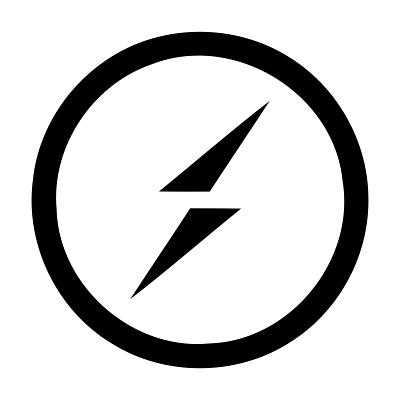

<h1 align="center">
    
</h1>

### I’m a frontend developer with a strong Angular focus and fullstack capabilities — dedicated to creating performant, scalable, and visually engaging web apps and more!

- 🌱 I’m currently deepening my knowledge of the latest Angular features, refreshing modern design practices, and refining software development principles to write more scalable, maintainable code.
- 💬 Ask me about **Angular, RxJS, TypeScript, Design Patterns, Node.js...or anything [here](https://www.linkedin.com/in/pdolecki/)**

 

  
  

## 🛠️ Languages and Tools

 

  
  
  
  
  
  
  
  
  
  
  
  
  
  
  
  
  
  
  
  
  
  
  
  
  
  
  
  
  
  
  
  
  
  
  
  
  

